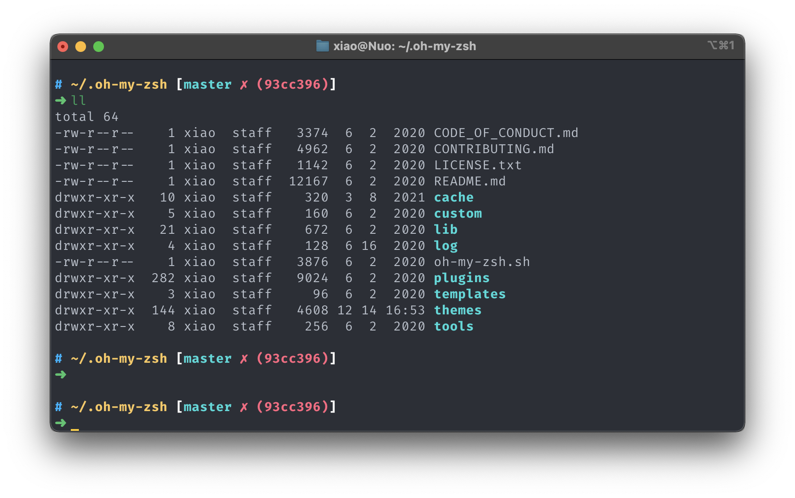

# Astro zsh theme [fix]

> source: [https://github.com/iplaces/astro-zsh-theme](https://github.com/iplaces/astro-zsh-theme)  
> Astro theme is based on ys theme and robbyrushell (default theme) theme.

## Screenshots



## Installation
### Clone the repository:

```shell
git clone https://github.com/qxxiao/config-backup.git
```

### Theme
1. Copy ./zsh-theme/astro.zsh-theme file into the ~/.oh-my-zsh/themes/ directory.
2. Change the theme variable name to ZSH_THEME="astro" in ~/.zshrc
3. Reload ZSH with source ~/.zshrc
4. [modify ~/.oh-my-zsh/lib/git.zsh](#Fix)
5. Font: FiraCode; Non-ascii Font: Wingdings3

## Fix
1. in no commit repo, missing right center bracket
```shell
# modify ~/.oh-my-zsh/lib/git.zsh

function git_prompt_short_sha() {
  local SHA
  SHA=$(command git rev-parse --short HEAD 2> /dev/null) && echo "$ZSH_THEME_GIT_PROMPT_SHA_BEFORE$SHA$ZSH_THEME_GIT_PROMPT_SHA_AFTER" || ( [[ $(git_prompt_info) != '' ]] && echo "$ZSH_THEME_GIT_PROMPT_SHA_AFTER2")
}

# Formats prompt string for current git commit long SHA
function git_prompt_long_sha() {
  local SHA
  SHA=$(command git rev-parse HEAD 2> /dev/null) && echo "$ZSH_THEME_GIT_PROMPT_SHA_BEFORE$SHA$ZSH_THEME_GIT_PROMPT_SHA_AFTER" || ( [[ $(git_prompt_info) != '' ]] && echo "$ZSH_THEME_GIT_PROMPT_SHA_AFTER2")
}
```
